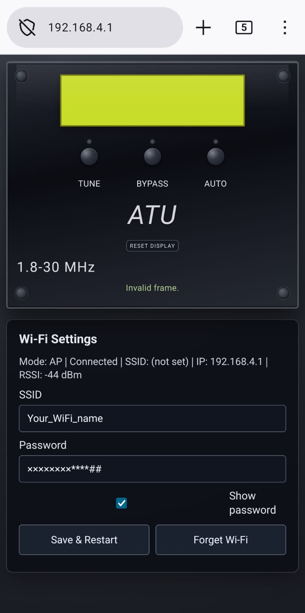

# ATU_RemDisplay_V1

ESP32-based remote front panel and Wi-Fi interface for the N7DDC ATU-100.

This project reproduces the main front-panel control actions of the real ATU through open-collector outputs, provides a browser-based control interface over Wi-Fi, and mirrors the ATU OLED display to the Web UI.

## Web interface

## Demo video

[Watch the project demo on YouTube](https://youtu.be/oE7csBFnlOc?si=iIyuglWNcs5BxYPG)

## Project concept

The ATU real front panel remains the reference behavior.

The ESP32 does not replace the ATU control firmware. Instead, it acts as an external remote interface that:

- simulates the front-panel button actions electrically
- exposes a Web UI over Wi-Fi
- mirrors the ATU OLED display to the browser
- keeps the original button semantics under control of the real ATU PIC firmware

This means short and long press interpretation for the ATU control lines remains in the original ATU hardware and firmware.

## Main functions

- Remote control of the ATU front-panel functions:
  - `AUTO/MANUAL`
  - `TUNE`
  - `BYPASS`
- OLED display mirroring to the browser through WebSocket updates
- Wi-Fi STA mode with saved credentials in NVS
- Automatic AP mode when no Wi-Fi credentials are stored
- Explicit `Forget Wi-Fi` action from the settings page
- Physical AP recovery through a long hold on the real `TUNE/RESET` line sensed by `GPIO23`
- Manual virtual OLED recovery through the Web UI `RESET DISPLAY` button

## Firmware behavior

### Wi-Fi

- If valid Wi-Fi credentials are stored, the ESP32 starts in STA mode and keeps retrying indefinitely.
- If no Wi-Fi credentials are stored, the ESP32 starts in AP mode.
- The AP mode is used for setup and configuration through the local web interface.

### AP recovery

- `GPIO23` is used only as an input.
- `GPIO23` monitors the real ATU `TUNE/RESET` line through an external resistor divider.
- If the sensed line remains low for `10 s` or longer, the firmware:
  - clears the saved Wi-Fi SSID and password from NVS
  - restarts the ESP32
  - comes back in AP mode on the next boot

### OLED mirror reset

The Web UI includes a `RESET DISPLAY` button for manually recovering the virtual OLED mirror.

When pressed, it:

- clears the virtual 128x32 GDDRAM buffer
- resets the virtual SSD1306 parser
- restores the fixed `128x32`, inverted, I2C address `0x3C` mirror profile
- publishes a blank mirror frame until new display data arrives from the ATU PIC

This function affects only the virtual OLED mirror. It does not reset the ESP32, restart Wi-Fi, erase Wi-Fi credentials, or alter the physical OLED display.

### Web UI front-panel buttons

The virtual buttons in the browser are pure front-panel emulation:

- `pressed` drives the corresponding output
- `released` releases the corresponding output

No press duration logic is interpreted by the ESP32 for those virtual front-panel buttons. The real ATU firmware remains responsible for short/long press meaning on the ATU control lines.

## Hardware architecture

The hardware is centered on an `ESP32 DevKit` board plus support circuitry for:

- power regulation
- open-collector button drive outputs
- OLED signal monitoring / mirroring
- logic-level adaptation between the ATU `5 V` domain and the ESP32 `3.3 V` domain
- Wi-Fi AP recovery sensing on the real `TUNE/RESET` line

### Main hardware blocks

- `ESP32 DevKit`
- voltage regulator
- open-collector driver stages for the ATU control lines
- resistor dividers for safe logic-level sensing from `5 V` to `3.3 V`
- OLED interface/mirroring hardware path

## Control line mapping

Current firmware mapping:

- `GPIO5` -> `AUTO/MANUAL`
- `GPIO19` -> `TUNE`
- `GPIO18` -> `BYPASS`
- `GPIO23` -> input-only sense of the real `TUNE/RESET` line for AP recovery

## Electrical documentation

The complete electrical schematic is available as a PDF:

- [ATU_RemDisplay_V1 electrical schematic](HW_Schematic/ATU_RemDisplay_V1_schematic.pdf)

KiCad source files are intentionally not distributed in this repository.

## Software structure

Relevant current files:

- [main/main.c](main/main.c)
- [main/atu_oled_mirror.c](main/atu_oled_mirror.c)
- [main/atu_oled_mirror.h](main/atu_oled_mirror.h)
- [spiffs/index.html](spiffs/index.html)
- [spiffs/script.js](spiffs/script.js)
- [spiffs/style.css](spiffs/style.css)

## Build environment

- ESP-IDF `v5.5.3`
- ESP32 target

## Ready-to-install firmware

Users who only need to install the released firmware do not need VS Code or
ESP-IDF. The [Release](Release/README.md) folder contains a complete browser
installer, all required firmware images, installation instructions, checksums,
and the hardware schematic. End users should open the **Installer link** on
the GitHub Release page, rather than download and open `index.html`. The link
opens the GitHub Pages installer at
`https://ptarsobastos.github.io/ATU_RemDisplay_V1/Release/web-installer/`.

## Validated status

This project version was intensively tested with the real ATU hardware under multiple operating conditions and was considered stable at consolidation time.
